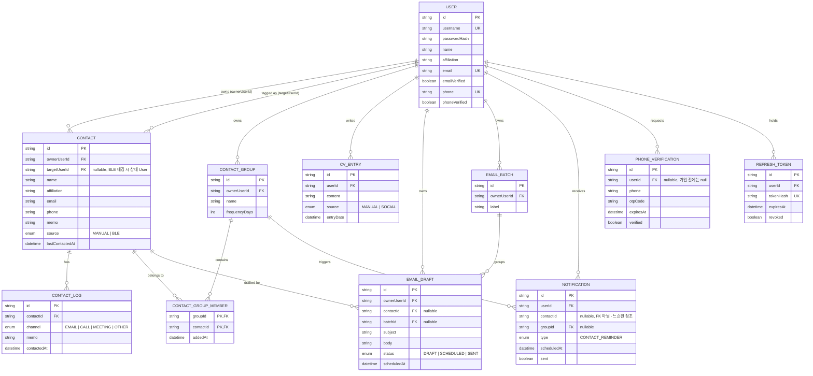

# ERD

원본 스키마: [`backend/prisma/schema.prisma`](../backend/prisma/schema.prisma) (Prisma가 source of truth이며 이 문서는 그것을 시각화한 것입니다).
스키마를 바꿀 때는 `schema.prisma`를 먼저 수정하고 이 문서를 그에 맞게 갱신하세요.



## CLAUDE.md 원본 스키마 대비 변경/보강 사항

1. **`RefreshToken` 모델 추가** — CLAUDE.md 섹션 3은 "DB에 refreshToken 해시 저장하여 로그아웃 시 무효화"를 요구하지만 원본 DDL에는 테이블이 없었습니다. `tokenHash` UK로 저장하고 `revoked` 플래그로 개별 로그아웃을 지원합니다.
2. **외래키 컬럼에 인덱스 추가** — Prisma는 관계 스칼라 필드에 자동으로 인덱스를 걸지 않으므로, `ownerUserId`/`contactId`/`groupId` 등 자주 조회되는 FK에 `@@index`를 명시했습니다.
3. **소유 관계에 `onDelete: Cascade`** — 유저/연락처/그룹 삭제 시 하위 레코드(로그, 그룹 멤버십, 초안 등)가 고아로 남지 않도록 지정했습니다. `Notification.contactId`는 원본 설계대로 FK 없는 느슨한 참조로 유지했습니다(연락처가 삭제돼도 알림 이력은 남기기 위함 — 필요시 기능 구현 단계에서 재논의).

## 다이어그램을 최신 상태로 유지하는 법

```bash
cd backend
npx prisma generate   # 스키마 유효성 검증
npx prisma studio     # 실제 데이터 GUI로 확인 (선택)
```
